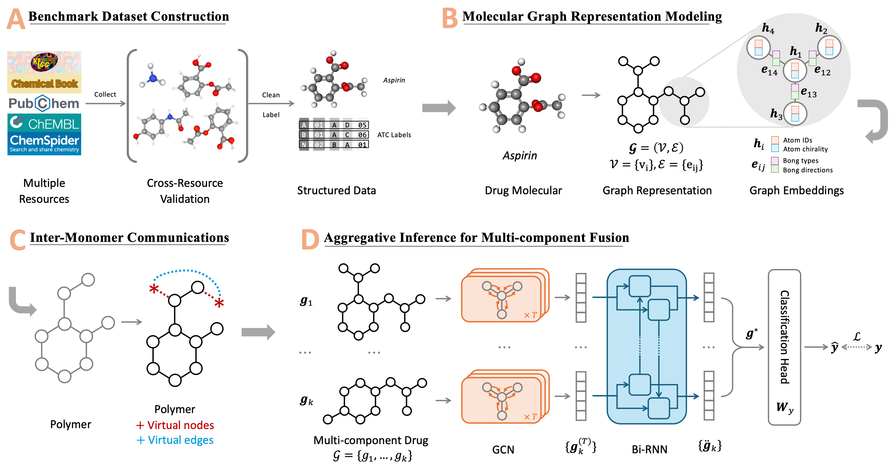

# GraphATC: advancing multilevel and multi-label anatomical therapeutic chemical classification via atom-level graph learning

[Wengyu Zhang](https://wengyuzhang.com), [Qi Tian](https://scholar.google.com/scholar?q=author:%22Qi%20Tian%22), [Yi Cao](https://academic.oup.com/bib/search-results?f_Authors=Yi+Cao), [Wenqi Fan](https://www.polyu.edu.hk/comp/people/academic-staff/prof-fan-wenqi/), [Dongmei Jiang](https://scholar.google.com/citations?user=Awsue7sAAAAJ), [Yaowei Wang](https://scholar.google.com/citations?user=o_DllmIAAAAJ), [Qing Li](https://www4.comp.polyu.edu.hk/~csqli/) and [Xiao-Yong Wei](https://www4.comp.polyu.edu.hk/~x1wei/).
</div>

[](https://doi.org/10.1093/bib/bbaf194)
[](https://doi.org/10.1093/bib/bbaf194)
[](https://doi.org/10.1093/bib/bbaf194)


[**Paper PDF**](https://academic.oup.com/bib/article-pdf/26/2/bbaf194/63012495/bbaf194.pdf) | [**Paper Website**](https://doi.org/10.1093/bib/bbaf194)

Official implementation of 'GraphATC: advancing multilevel and multi-label anatomical therapeutic chemical classification via atom-level graph learning', published in 'Briefings in Bioinformatics, Volume 26, Issue 2, March 2025' on 26 April 2025, [https://doi.org/10.1093/bib/bbaf194](https://doi.org/10.1093/bib/bbaf194)
<p align="center"></p>

The accurate categorization of compounds within the anatomical therapeutic chemical (ATC) system is fundamental for drug development and fundamental research. Although this area has garnered significant research focus for over a decade, the majority
of prior studies have concentrated solely on the Level 1 labels defined by the World Health Organization (WHO), neglecting the labels of the remaining four levels. This narrow focus fails to address the true nature of the task as a multilevel, multi-label classification challenge. Moreover, existing benchmarks like Chen-2012 and ATC-SMILES have become outdated, lacking the incorporation of new drugs or updated properties of existing ones that have emerged in recent years and have been integrated into the WHO ATC system. To tackle these shortcomings, we present a comprehensive approach, GraphATC.

**Our contributions**:
- We have constructed the most extensive ATC dataset to date.
- We implement the multilevel, multi-label study by extending the task to Level-2 (i.e. L2).
- We build more accurate representations for polymers.
- We optimize the representation learning for macromolecular drugs.
- We build a more effective framework for aggregating component representations of multicomponent drugs.


## 📢 News

- **[2025.4.26]** Our paper has been published in Briefings in Bioinformatics.
- **[2025.4.07]** Our paper has been accepted by Briefings in Bioinformatics.


## 📋 TODO
- [x] Create GraphATC repository;
- [x] Add brief introduction of the GraphATC;
- [ ] Release the dataset;
- [ ] Release the source code;
- [ ] Release the web server;
- [ ] Release more details;


## 📖 Citation
If you find the repository or the paper useful, please use the following entry for citation.

> Wengyu Zhang, Qi Tian, Yi Cao, Wenqi Fan, Dongmei Jiang, Yaowei Wang, Qing Li, Xiao-Yong Wei, GraphATC: advancing multilevel and multi-label anatomical therapeutic chemical classification via atom-level graph learning, *Briefings in Bioinformatics*, Volume 26, Issue 2, March 2025, bbaf194, https://doi.org/10.1093/bib/bbaf194

```
@article{10.1093/bib/bbaf194,
    author = {Zhang, Wengyu and Tian, Qi and Cao, Yi and Fan, Wenqi and Jiang, Dongmei and Wang, Yaowei and Li, Qing and Wei, Xiao-Yong},
    title = {GraphATC: advancing multilevel and multi-label anatomical therapeutic chemical classification via atom-level graph learning},
    journal = {Briefings in Bioinformatics},
    volume = {26},
    number = {2},
    pages = {bbaf194},
    year = {2025},
    month = {04},
    issn = {1477-4054},
    doi = {10.1093/bib/bbaf194},
    url = {https://doi.org/10.1093/bib/bbaf194},
    eprint = {https://academic.oup.com/bib/article-pdf/26/2/bbaf194/63012495/bbaf194.pdf},
}
```
